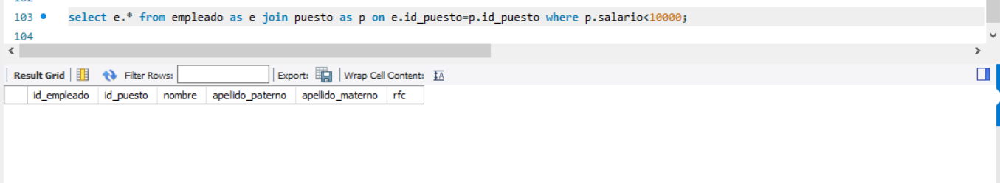
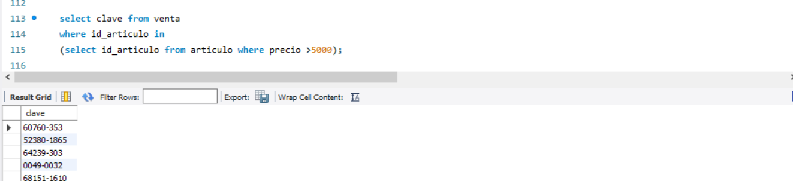
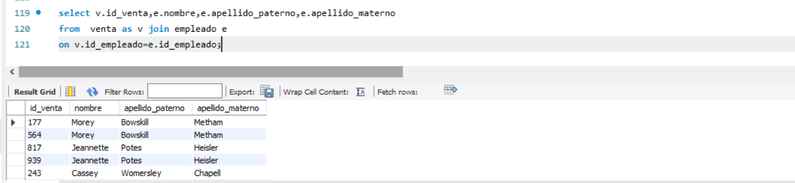
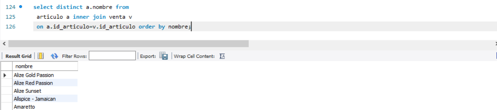
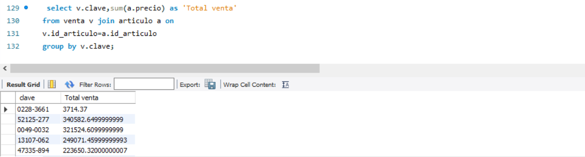
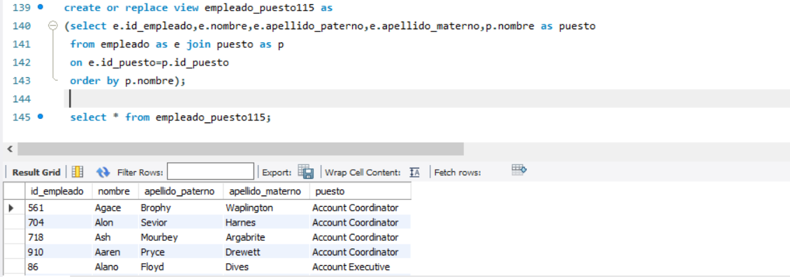
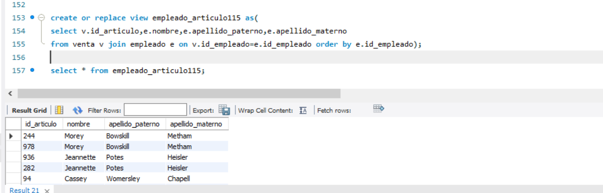
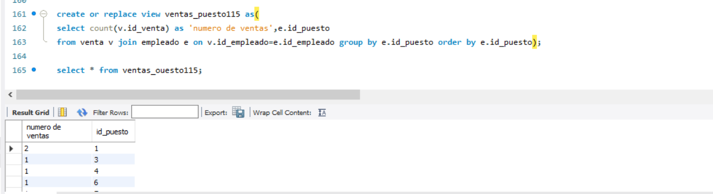

# Reto 1

## ¿Cuál es el nombre de los empleados cuyo sueldo es menor a $10,000?

```sql
select e.* from empleado as e join puesto as p on e.id_puesto=p.id_puesto where p.salario<10000;
```


``` sql
select * from empleado where id_puesto in (select id_puesto from puesto where salario<10000);
```

ya que no tenemos ningún empleado con sueldo menor a 10000 podríamos cambiar menor que a mayor que pero nos devolvería todos .

```sql
select * from empleado where id_puesto in (select id_puesto from puesto where salario>10000);
```



## ¿Cuál es la cantidad mínima y máxima de ventas de cada empleado?

``` sql
select id_empleado,max(total),min(total) 
from (select id_empleado,count(*) as total,clave
 from venta group by clave,id_empleado) as sub
 group by id_empleado;
```


## ¿Cuáles claves de venta incluyen artículos cuyos precios son mayores a $5,000?

``` sql
select clave from venta
 where id_articulo in 
 (select id_articulo from articulo where precio >5000);
```



# Reto 2

## ¿Cuál es el nombre de los empleados que realizaron cada venta?

```sql
select v.id_venta,e.nombre,e.apellido_paterno,e.apellido_materno
from  venta as v join empleado e 
on v.id_empleado=e.id_empleado;
 
```



## ¿Cuál es el nombre de los artículos que se han vendido?

```sql
select distinct a.nombre from
 articulo a inner join venta v
 on a.id_articulo=v.id_articulo 
 order by nombre;
```



## ¿Cuál es el total de cada venta?

```sql
select v.clave,sum(a.precio) as 'Total venta'
from venta v join articulo a on
v.id_articulo=a.id_articulo 
group by v.clave;
```



# Reto 3

vistas

## Obtener el puesto de un empleado.

```sql
create or replace view empleado_puesto115 as 
(select e.id_empleado,e.nombre,e.apellido_paterno,e.apellido_materno,p.nombre as puesto 
 from empleado as e join puesto as p 
 on e.id_puesto=p.id_puesto 
 order by p.nombre);
```




## Saber qué artículos ha vendido cada empleado.

```sql
create or replace view empleado_articulo115 as
(
 select v.id_articulo,
    e.nombre,
    e.apellido_paterno,
    e.apellido_materno 
    from venta v join empleado e on
    v.id_empleado=e.id_empleado 
    order by e.id_empleado
);
```



## Saber qué puesto ha tenido más ventas.

```sql
create or replace view ventas_puesto115 as
(
 select 
    count(v.id_venta) as 'numero de ventas',
    e.id_puesto 
 from venta v join empleado e 
    on v.id_empleado=e.id_empleado 
    group by e.id_puesto 
    order by e.id_puesto
);
```



